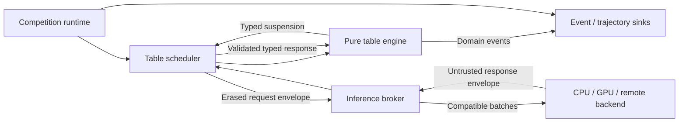
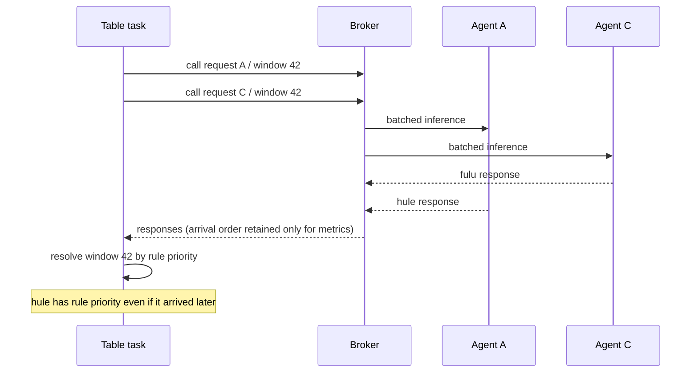

# アーキテクチャ

## 1. 概要

LizhiSim は「純粋な卓内状態機械」「多数卓を駆動する orchestration」「GPU 推論をまとめる broker」「複数対局を構成する competition」の四つを分離する。中心に同期 `step()` loop を置かない。



状態とルールの意味論は engine にあり、並行性と失敗回復は shell にある。competition は卓の内部を変更せず、開始条件を渡して結果を受け取る。

## 2. レイヤーと依存方向

### 2.1 Domain

値型、typestate、合法手、局・対局の遷移、精算、ドメインイベント、port trait を持つ。async runtime、queue、serialization、GPU、ファイル I/O に依存しない。

### 2.2 Rules

Raw 設定の構文、検証、完全な `ValidatedRuleSet<P>`、プリセット metadata、差分 report を持つ。公式サービス名を条件分岐に使わず、解決済み設定を domain に渡す。

### 2.3 Engine orchestration

論理卓の生成・再開・終了、continuation の所有、timeout/cancel の注入、backpressure、event sink への配送を行う。domain の結果を解釈するが、麻雀ルールを再実装しない。

### 2.4 Inference protocol

観測・action schema、request/response envelope、model metadata、batch compatibility key、backend port を定義する。外部応答はこの境界で parse し、domain 型へ検証変換する。

### 2.5 Competition

roster、stage、schedule、table assignment、standing、ranking、advancement を扱う。`TableMatchResult` を入力に集計し、次の卓割りまたは大会終了を出力する。

### 2.6 Adapters

`xiangting`、`hule`、乱数源、永続化、metrics、推論 backend を実装する。adapter から domain への逆依存は禁止する。

依存方向は常に外側から内側である。

```text
applications / runtime
    -> competition, orchestration, inference protocol
        -> rules, domain ports
            -> domain values and transitions

adapters -> corresponding ports
domain -X-> adapters, async runtime, storage, GPU
```

## 3. Functional core / imperative shell

pure core へ渡す値は、検証済みルール、現在状態、型付き応答、決定的な外部事実である。core は次のいずれかを返す。

- 直ちに進められる新しい状態とイベント
- 外部応答が必要な `Suspension<R, K>`
- 局または対局の完了結果とイベント
- 状態を変更しない型付き domain error

現在時刻の取得、乱数生成、推論、ファイル書込みを遷移関数内で行わない。timeout は shell が `DecisionTimedOut` という事実を生成して core へ渡す。牌山は開始前に確定した値として渡すか、版付き RNG adapter の結果を記録してから渡す。

## 4. 型付き継続渡し

### 4.1 目的

`step(action)` は、どの action を受け取れる状態かを呼出側と実装の約束に委ねる。LizhiSim では、状態ごとに受け取る応答型と再開先を結び付ける。

概念モデルは次のとおりであり、Rust API の確定コードではない。

```text
Transition<S>
  = Advanced<S2, Events>
  | Suspended<Request<R>, Continuation<R>, Events>
  | Completed<Result, Events>

resume : Continuation<R> x R -> Transition<S2>
```

継続は closure をそのまま永続化するのではなく、必要な次状態を持つ閉じた enum として **defunctionalize** する。これにより clone 不能な隠れ状態、任意コードの捕捉、serialization 不能な closure を避ける。

### 4.2 内部の型と queue 境界

内部では `Request<R>` と `Continuation<R>` の `R` が一致する。異種要求を一つの queue に置く境界で、request kind、schema version、payload を envelope に型消去する。応答時には次の順で型を復元する。

1. request ID で pending suspension を特定する。
2. response kind と schema version を照合する。
3. actor、model、table lifecycle を照合する。
4. payload を期待する応答型へ decode する。
5. action を保存済みの合法手集合へ照合する。
6. 一度だけ continuation を消費して再開する。

型消去は transport 境界だけに限定し、domain の任意状態へ `Any` や unchecked cast を導入しない。

### 4.3 鳴き窓

打牌後は複数 seat が同時に候補を持ち得る。各 response の到着順に遷移せず、同じ `CallWindowId` に属する slots を埋める。全 required slot が応答、timeout、cancel のいずれかで解決した後、ルールの優先順位で一度だけ解決する。



## 5. イベント駆動実行

各論理卓は次の lifecycle を持つ。

```text
Created -> Runnable -> Suspended -> Runnable -> ... -> Completed
                    \-> Cancelled / Failed
```

一卓につき domain continuation は高々一つの所有者が持つ。call window の複数 request は一つの suspension に属する。request の重複送信は許容できるが、continuation の二重再開は禁止する。

Scheduler は Runnable 卓を公平に駆動し、一定量の純粋遷移後に制御を返させる。無限に即時遷移できるバグを一卓が独占しないよう、drive budget を持つ。budget は麻雀結果に影響せず、再 schedule の単位だけを変える。

## 6. 推論バッチ

Inference broker は次を含む compatibility key で要求を分類する。

- model artifact/version
- observation schema version
- decision head/action schema
- tensor shape/dtype
- target device/backend
- inference options that change semantics

batch は最大件数、最大 token/byte、最古要求の待ち時間、優先度から flush する。batch の境界が action の意味や replay を変えてはならない。backend が乱数サンプリングを行う場合は、要求ごとの RNG key を渡して batch packing から独立させる。

## 7. 決定性と replay

決定性の単位は `ResolvedExperimentSpec` である。少なくとも次を含む。

- table/match/competition/ranking rules の不変 ID と内容 hash
- observation/action/event schema version
- engine と adapter の版
- `xiangting` と `hule` の版または commit
- wall sequences、または RNG algorithm/version/seed と十分な生成記録
- model artifact hash と sampling configuration
- timeout/cancel/failure policy

GPU 演算そのものの bitwise determinism が保証できない場合は、選択済み action を event として保存し、対局 replay は action event から決定的に行う。モデルの再推論と対局の再生を混同しない。

event は少なくとも experiment、competition、table match、round の stream に分け、stream 内 sequence を単調増加させる。wall clock timestamp は観測情報であり、順序の根拠にしない。

## 8. エラー分類

一つの汎用エラーへ潰さず、回復責務で分類する。

| 分類 | 例 | 主な処理 |
|---|---|---|
| Configuration | 不整合な三麻牌構成、出典未確認 preset | 開始前に拒否 |
| Protocol | schema 不一致、不正 payload、未知 action | 応答拒否、policy に従い再試行/失格 |
| Lifecycle | duplicate、late、cancelled request | 状態を変えず監査 event |
| Domain | capability 不足、表現済みだが未対応の条項 | 対局を開始しない、または明示的失敗 |
| Backend | GPU OOM、network failure | retry/fallback/cancel policy |
| Integrity | replay hash 不一致、event sequence 破損 | run を invalid として隔離 |
| Bug | 到達不能な内部不変条件違反 | 診断情報を残し process 境界で隔離 |

対局を黙って継続する fallback は、学習データを汚染するため原則禁止する。fallback を使う実験は設定と event に明示する。

## 9. 将来の workspace 境界

最初の実装境界として、利用者向け`lizhisim`をre-export専用facade、domain実装を所有する`lizhisim-core`を内部crateとする。[ADR-0014](../adr/0014-facade-and-core-crates.md)で確定した。以下はwalking skeleton後に必要性を再評価する追加候補であり、先回りして作らない。

| 候補 crate | 責務 |
|---|---|
| `lizhisim-core` | 値型、typestate、純粋遷移、domain port。現在作成済み |
| `lizhisim-rules` | raw設定schema、検証、解決済みrule、preset registry。domain実行値は`lizhisim-core`の型へ変換する |
| `lizhisim-protocol` | 観測、action、request/response、event schema |
| `lizhisim-engine` | 論理卓 scheduler と continuation runtime |
| `lizhisim-inference` | batching broker と backend port |
| `lizhisim-competition` | schedule、standing、ranking、advancement |
| `lizhisim-replay` | event store、canonicalization、replay |
| `lizhisim-adapter-xiangting` | `xiangting` port 実装 |
| `lizhisim-adapter-hule` | `hule` port 実装 |
| `lizhisim-app` | 実験設定の composition root |
| conformance app crate（crate名未決） | userがlocalに置いた`majsoul-record`のdecode、projection、匿名化、LizhiSimとの1パスfull-record比較、diff report。取得機能は持たず、`game_log`出力は任意の診断機能とする |

`lizhisim-core`より先のcrate分割は、循環依存を避ける必要とwalking skeletonの変更頻度・compile costを確認してからADRで確定する。

牌構成については[ADR-0015](../adr/0015-rule-and-domain-tile-ownership.md)に従い、raw設定と
`ValidatedRuleSet<P>`を`lizhisim-rules`、実行時の`TileSet`を`lizhisim-core`が所有する。
依存方向は`lizhisim-rules -> lizhisim-core`とし、coreからrulesへの逆依存を禁止する。
`TileSet`は`Bingpai`と`Bipai`から独立した`tile_set` moduleに置く。

## 10. 拡張境界

- storage は event/trajectory sink の port とし、初期形式を domain に固定しない。
- inference backend は local CPU/GPU/remote を差し替える。
- scheduling policy は意味論と分離するが、選択結果は event 化する。
- rule plugin の動的コード読み込みは当面行わない。型安全性と再現性のため、対応規則は compile-time の閉じた代数型と versioned data で増やす。
- Gym adapter は拡張境界にも置かない。将来要望があっても core を同期 step model に歪めない。

## 11. 関連 ADR

- [ADR-0001: イベント駆動・型付き継続を採用する](../adr/0001-event-driven-typed-continuations.md)
- [ADR-0002: ルールを層別化し出典付き不変版として管理する](../adr/0002-versioned-rule-layers.md)
- [ADR-0003: 大会ドメインを卓内エンジンから分離する](../adr/0003-separate-competition-domain.md)
- [ADR-0004: 麻雀用語はピンインを基本とし、Roundを局専用にする](../adr/0004-pinyin-terminology-and-round.md)
- [ADR-0006: Rust toolchain、初期 workspace、CI baselineを固定する](../adr/0006-rust-toolchain-workspace-and-ci.md)
- [ADR-0014: facadeとcore crateを分離する](../adr/0014-facade-and-core-crates.md)
- [ADR-0015: 牌構成設定と実行時牌上限の所有crateを分離する](../adr/0015-rule-and-domain-tile-ownership.md)
