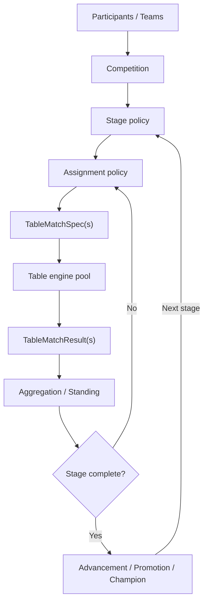
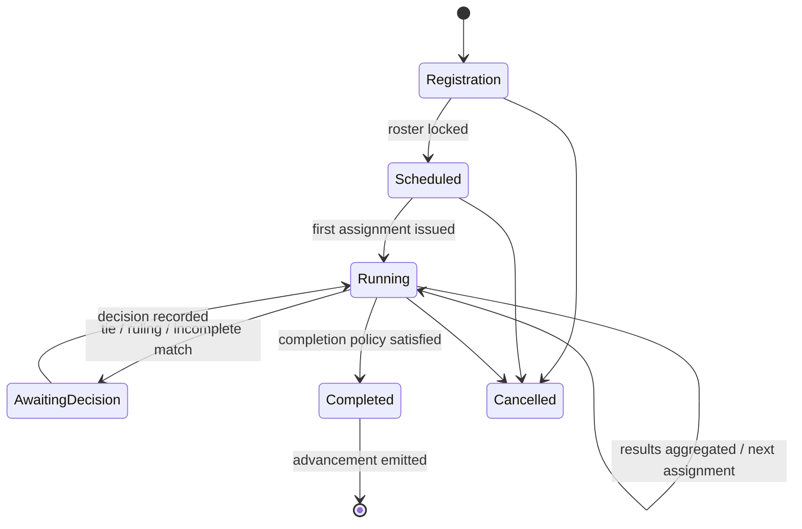

# 大会・段位戦・リーグ戦

## 1. なぜ卓内 engine と分けるか

一つの半荘は参加者の得点と順位を返せば完結する。一方、段位戦は母集団と queue、league は schedule と累積順位、tournament は勝ち上がりと再配置を持つ。卓内 engine がこれらを知ると、同じ M リーグ卓内ルールを別の大会で再利用できず、半荘のテストに season 全体が必要になる。

Competition domain は `TableMatchSpec` を発行し、`TableMatchResult` を受け取る唯一の関係にする。`Round` は局を意味するため、competition の日程単位には使わない。



## 2. 集約モデル

### 2.1 Competition

大会全体の identity、rules bundle、roster、stage graph、seed、状態、event stream を持つ。直線的な stage 列だけでなく、予選から複数 playoff へ分岐して決勝で合流する DAG を許す。循環は season 間の別 competition として表し、一つの competition graph 内では禁止する。

### 2.2 Stage

同じ schedule、assignment、scoring、completion、advancement policy を共有する区間。

例:

- 段位戦の一定期間
- league のレギュラー season
- 予選 5 回戦
- 上位 16 名の準決勝
- team league の semifinal
- 条件を満たすまで続く決勝

### 2.3 Matchday

一つ以上の `TableAssignment` を束ねる。`Matchday` が同時刻や暦上の一日である必要はないが、次の組合せが前 `Matchday` の全結果に依存する場合の barrier になる。オンライン段位戦では `Matchday` barrier を持たず、matchmaking window を別の scheduling event として扱える。

### 2.4 TableAssignment

以下を完全に決めた値。

- 参加者 3/4 名と seat
- 使用する table/match rule version
- model version/agent binding
- wall/RNG key policy
- matchday/stage/table identity
- completion/failure policy

assignment 以後に座順を暗黙 randomize しない。randomize する policy の選択結果を assignment event に記録する。

### 2.5 Standing

raw match results と administrative adjustment から再計算可能な materialized view。手修正した合計値を source of truth にしない。

## 3. サッカーリーグ設計から借りるもの、借りないもの

参考になる要素:

- season、division、matchday、fixture、standing の分離
- schedule と試合結果の分離
- 勝点、得失点、tie-break の ordered rules
- promotion/relegation、playoff、未消化試合
- チーム roster と当日 lineup の分離
- 規定改定を season 単位で固定する考え方

麻雀固有で異なる要素:

- 一試合が二者ではなく 3/4 者の hyperedge である。
- 同じ参加者 pair の同卓回数だけでなく、三者・四者の組合せと seat balance がある。
- 順位、素点、半荘ポイントを同時に得る。
- team league でも一卓へ各 team から一人ずつ出す形式がある。
- 決勝が固定回数でなく「規定回数後に条件達成者が出るまで」の場合がある。

したがって二者用 `home_team/away_team` model を流用せず、`NonEmptySet<ParticipantSlot<P>>` と multi-party result を中心にする。

## 4. Stage format

Stage は format enum と policy の組合せで構成する。

### 4.1 Fixed schedule league

事前に全 assignment を固定する。公式 league の再現、座順指定、broadcast order に向く。未消化、延期、無効試合は event で管理する。

### 4.2 Round-robin / balanced league

参加人数と卓人数に応じ、同卓回数と座順偏りを最小化する schedule を生成する。完全な組合せが不可能な場合、optimizer の目的関数と tie-break seed を記録する。

### 4.3 Swiss-like

各 `Matchday` 後の standing または strength band に基づき近い参加者を同卓させる。再同卓回避、team conflict、seat balance を制約にする。二者 Swiss の既存式をそのまま使わず、multi-party matching policy として定義する。

### 4.4 Ladder / ranked queue

到着した参加者を eligibility と matching band でまとめ、卓が成立するたび assignment を作る。stage の終了は期間、対局数、experiment budget、母集団収束条件など外から与える。

### 4.5 Cut after N matches

各参加者が規定回数を打ち、上位 K、各卓上位、wild card 等が進出する。規定回数超過時の best consecutive N、平均、全戦合計などを明示する。

### 4.6 Knockout / bracket

固定半荘数、卓上位 N 名、aggregate target、条件付き延長を扱う。敗退者を次 assignment に入れないことを型付き stage state で保証する。

### 4.7 Hybrid

league -> semifinal -> final、group -> knockout、qualifier -> seeded bracket を stage graph で構成する。stage 間の point carry-over は明示的 transformation とする。

## 5. Assignment policy

policy の入力:

- eligible participants/teams
- 過去の seat、同卓、対戦回数
- current standing/rating band
- unavailable/bye/withdrawal
- table player count
- constraint と objective の優先順位
- deterministic seed

policy の出力:

- assignments
- unmatched/bye participants と理由
- constraint violation がある場合の明示 report
- decision trace（候補全列挙は不要だが tie-break 根拠を含む）

hard constraints と soft objectives を分ける。

Hard の例:

- 同一 participant を同じ `Matchday` の複数卓へ割り当てない。
- 必要人数を満たす。
- 同一 team から一人まで、など stage 固有制約。
- 失格・未登録 participant を除外する。

Soft の例:

- 同卓回数の最大差を減らす。
- 各 seat 回数を均す。
- rating 差を減らす。
- broadcast/table preference を満たす。

soft objective の重みを変えると結果が変わるため、policy version と設定を run に保存する。

## 6. 段位戦とレーティング

段位戦は `RankingPolicy` と `MatchmakingPolicy` に分ける。

### 6.1 RankingPolicy

- rank/tier の ordered definition
- rank 内 points と初期値
- room/mode/placement ごとの増減
- rank または player count による補正
- promotion/demotion threshold
- 降段保護、最低値、失効
- rating 計算と表示 rating（段位 point と別の場合）
- season reset / decay
- 四麻と三麻の独立性

更新は pure function とする。

```text
update_rank(
  policy_version,
  before_rank_state,
  ranked_match_result
) -> after_rank_state + rank_events
```

順位 point の更新と卓上の点棒精算を混ぜない。場代や entry cost がある場合も reason 付き rank transfer とする。

### 6.2 MatchmakingPolicy

- queue/mode
- 入場可能 tier/rating
- matching band と待ち時間による拡大
- server/region（再現対象に必要な場合）
- bot 補充の可否
- 同一 agent/model の同卓制約
- seat assignment

本番サービスの network latency を再現する必要はない。母集団研究で待ち時間が意味を持つ場合のみ、simulation clock と arrival event を使う。

### 6.3 プリセット分離

たとえば同じ雀魂四麻卓内ルールを複数 room が使い、段位 point だけ異なるなら次のように合成する。

```text
TableRules:   mahjongsoul-four-player-rules@X
MatchRules:   mahjongsoul-four-player-south@Y
RankingPolicy: mahjongsoul-gold-room-four-player@Z
```

実験記録には三つの解決済み ID/hash を残す。

## 7. チーム戦

`Team` は participant の集合、`Lineup` は特定 `Matchday`/table へ出す participant の割当である。

- roster eligibility と lineup selection を分ける。
- 一人あたり最低/最大出場数を stage constraint にできる。
- team score を individual match point の合計、順位点、勝敗点などから構成できる。
- lineup が AI 方策で決まる場合は、それも decision request と event にできるが、卓内 inference queue とは request kind を分ける。
- 移籍、roster change、選手入替規定は season event とする。

## 8. 集計

match result は不変の raw input とし、次を reason 付きで積み上げる。

```text
StandingEntry
  raw_table_points
  placement_points
  team_points
  bonuses
  penalties
  carry_over
  total
  tie_break_values
```

### 8.1 集計 window

- 全戦合計
- 最新 N 戦
- 連続 N 戦の最大合計
- 上位 N 戦
- 規定数に満たない場合は無資格
- stage 間の割合または固定値持越し

window が online の無制限対局に対して計算可能か、tie の場合にどの区間を選ぶかを定義する。

### 8.2 Tie-break

ordered list として適用する。

- total points
- 1 位回数、平均順位、素点
- direct table result
- seed/予選順位
- 同順位として point を分ける
- 追加対局

最後に暗黙の participant ID 順で決めない。完全同点を許すか、最終 deterministic tie-break を何にするかを policy に含める。

### 8.3 Penalty と裁定

実卓のチョンボ、出場違反、administrative deduction は `StandingAdjustmentApplied` event として raw result の外へ付ける。誰が、どの規定版で、なぜ適用したかを metadata に持つ。過去 result を上書きしない。

## 9. Stage state machine



`AwaitingDecision` は人間の入力を必須にするとは限らず、別の pure policy または tournament director agent が解決できる。推測で勝者を決めず、未解決状態を一級に扱う。

## 10. 失敗と再試合

卓 engine の失敗時 policy:

- retry same assignment with same wall/action log（backend failure のみ）
- replay from last verified snapshot
- void and reschedule with new wall
- forfeit participant
- suspend stage for ruling

どの方針も結果が変わり得るため、stage 設定と event に記録する。部分的に完了した卓を成功結果へ混ぜない。retry で同じ request を再推論する場合と、記録済み action を再利用する場合を区別する。

## 11. 最小 vertical slices

実装順は機能別 horizontal layer ではなく、次の縦切りを候補とする。

1. 固定 4 名、固定座順、固定牌山、1 半荘、結果集計
2. 8 名 2 卓 x 複数 `Matchday`、固定 schedule、standing
3. 結果依存の上位進出と final
4. rating band を使う四麻 ranked queue
5. team roster/lineup と team standing
6. 三麻を混在させた独立 competition

各 slice は [開発手順書](../development-guide.md) の test list から開始する。
