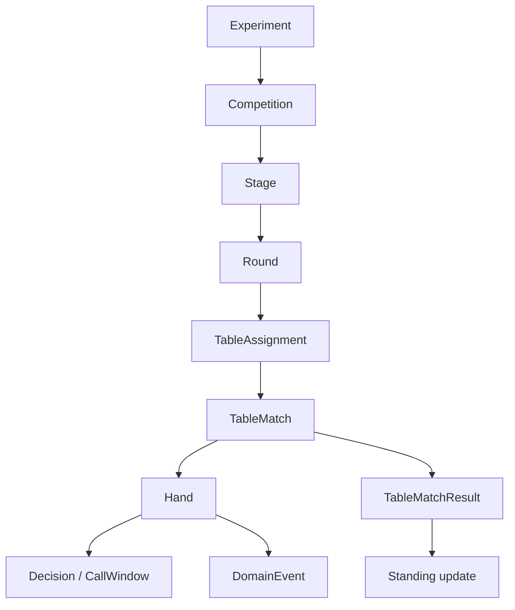
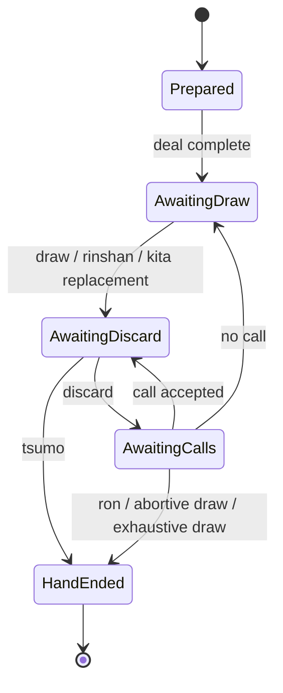

# ドメインモデル

## 1. モデルの階層



卓内 engine が直接知るのは `TableMatch` 以下である。Competition は `TableMatchSpec` を発行し、`TableMatchResult` を受け取る。

## 2. プレイヤー数を型へ持ち上げる

四人と三人は単なる `usize` の違いではない。使用牌、seat、支払、合法 action、順位点の長さが変わるため、player set を型 parameter とする。

```text
PlayerSet
  = Yonma  { Seats = East, South, West, North }
  | Sanma  { Seats = East, South, West }

ValidatedRuleSet<P: PlayerSet>
TableState<P: PlayerSet, S: Phase>
Placement<P: PlayerSet>
```

これは擬似表現である。const generic と trait のどちらを採用するかは walking skeleton で決める。要件は、四人用の順位配列を三人卓へ渡せないこと、無効 seat を作れないことである。

実験設定の読込み時は人数が runtime 値なので、境界 enum `AnyValidatedRuleSet = Yonma(...) | Sanma(...)` で分岐し、分岐後の core は generic な検証済み型で動かす。

## 3. 主要な値型

primitive obsession を避け、少なくとも次を区別する。

- `ExperimentId`, `CompetitionId`, `TableMatchId`, `HandId`, `RequestId`, `CallWindowId`
- `ParticipantId`, `TeamId`, `ModelId`, `Seat<P>`
- `TileKind`, `TileCopy`, `RedTile`, `WallPosition`
- `Points`, `PlacementPoint`, `RankPoint`, `PenaltyPoint`
- `Honba`, `RiichiDeposit`, `RoundWind`, `DealerIndex`
- `RuleSetId`, `RuleContentHash`, `SchemaVersion`, `ModelArtifactHash`
- `EventSequence`, `RngKey`, `StateHash`

得点は単位を型で分ける。1000 点を 1.0 とした大会ポイント、卓上の点棒、段位ポイントを同じ整数型で加算できてはならない。

## 4. 牌と牌山

`TileKind` は意味上の種類、`TileCopy` は赤牌を含む物理 copy を表す。ドラ表示、手牌、河では identity が必要な箇所だけ `TileCopy` を持ち、モデル feature へ射影するときに kind/red flag へ変換する。

`TileSetRules<P>` は次を検証する。

- kind ごとの copy 数と総牌数
- 赤牌が同 kind の copy 数を超えない
- 三麻で除外された牌が配牌・山・ドラ循環に現れない
- 北抜きを使う場合の北牌の存在と扱い
- 王牌、嶺上牌、ドラ表示位置と槓上限の整合

牌山生成は adapter の責務だが、生成後の `Wall<P>` は完全な値として core に渡す。再現性の最も強い記録は牌 copy の順序そのものであり、seed のみの保存は RNG 実装版が固定されている場合に限る。

## 5. Typestate

局を nullable field の集合で表現しない。Phase ごとに必要な data と合法な遷移を分ける。



実際には次の中間状態も分離候補になる。

- `AwaitingReplacementDraw` — 槓または北抜き後
- `AwaitingChankan` — 加槓/暗槓に対する和了窓
- `ResolvingKan` — 槓成立、ドラ公開、嶺上の順序
- `AwaitingRiichiConfirmation` — 宣言牌へのロン・鳴きと供託成立の境界
- `ExhaustedWall` — 聴牌公開と流局精算

各状態は可能な操作だけを公開する。たとえば `AwaitingDraw` に discard を受ける関数は存在しない。

## 6. 所有権を用いた遷移

遷移関数は `&mut` で任意箇所を更新し続けず、現在状態を消費する。成功時に新状態を返し、失敗時は入力状態を変更しない。

```text
discard(
  AwaitingDiscard<P>,
  LegalDiscard
) -> Advanced<AwaitingCalls<P>> | Completed<HandResult>
```

大きな immutable structure を毎回 deep clone することは要求しない。Rust の所有権、small copy value、内部で安全に閉じた copy-on-write などを計測して選ぶ。ただし性能最適化のために、外部から途中状態を観測できる部分更新や rollback 前提の設計へ戻さない。

## 7. Action

モデル向けの安定 `ActionId` と、domain の型付き action を分ける。

```text
ModelActionId --decode + legal set--> TypedAction

TypedAction
  Discard(DiscardAction)
  DeclareRiichi(RiichiDiscardAction)
  Tsumo(TsumoAction)
  Pass(PassAction)
  Chi(ChiAction)
  Pon(PonAction)
  Kan(KanAction)
  Ron(RonAction)
  Kita(KitaAction)
```

すべての variant がすべての decision point で使えるわけではない。合法手生成時に action の完全なパラメータを持たせ、model はその有限集合から選択する。model から任意の tile index を受けて後から意味を推測しない。

同じ見た目の打牌でも、リーチ宣言を伴う action と通常打牌は別 action とする。暗槓候補が複数ある場合も各候補を別 ID にする。

## 8. 鳴き窓のモデル

`CallWindow` は次を保持する。

- 原因 event（discard、added kan、concealed kan など）
- rule snapshot ID
- eligible seat と各 seat の `LegalCallSet`
- required/optional response slot
- timeout/disconnect の解決値
- すでに受理した応答
- 一度だけ使える resolution continuation

解決は次の純粋関数で考える。

```text
resolve_call_window(rules, cause, responses)
  -> NoCall | WinningCalls | MeldCall | AbortiveOutcome
```

ロン同士、ロンとポン、ポンとチーの優先順位、頭ハネ/複数ロン/三家和流局はここで決める。queue 到着時刻は引数に含めない。

## 9. 和了・シャンテン port

domain は外部 crate の data model へ直接合わせない。

```text
ShantenPort
  evaluate(ValidatedHandShape, TileAvailability?) -> ShantenResult

WinEvaluationPort
  evaluate(WinContext, ValidatedRuleCapabilities) -> WinEvaluation
```

`WinContext` は concealed tiles、melds、winning tile、seat/round wind、win method、riichi state、special circumstances、dora indicators を明示する。adapter が不足情報を global state から取りに行かない。

`WinEvaluation` と実際の支払は分ける。前者は役・符・翻・base points、後者は honba、deposit、責任払い、三麻ツモ補正、複数和了を含む `PaymentPolicy` が `PointTransfers` を生成する。

`hule` が点数移動まで計算する場合も、capability を明示し、重複計算を避ける境界を契約テストで固定する。

## 10. 対局進行

`TableMatchState<P>` は終了していない `Hand` と、次の hand を開始するための ledger を分ける。

- current round wind / dealer
- honba / riichi deposits
- seat points
- match rule snapshot
- completed hand summaries
- termination context

局終了時に `HandSettlement` を適用し、次のいずれかを返す。

```text
Continue(NextHandSpec)
Extend(NextHandSpec, ExtensionReason)
Finish(TableMatchResult)
```

アガリ止め、聴牌止め、トップ条件、飛び、規定場、延長上限、同点は `MatchTerminationPolicy` が判断する。局 engine 内へ特定サービス名の分岐を置かない。

## 11. イベント

command/response と event を区別する。event は起きた事実を過去形で表す。

候補 category:

- lifecycle: `TableMatchStarted`, `HandStarted`, `HandEnded`, `TableMatchEnded`
- wall: `WallCommitted`, `TilesDealt`, `TileDrawn`
- action: `TileDiscarded`, `RiichiDeclared`, `MeldCalled`, `KanDeclared`, `KitaDeclared`
- resolution: `CallWindowOpened`, `DecisionAccepted`, `CallWindowResolved`
- outcome: `WinConfirmed`, `HandDrawn`, `PointsTransferred`
- protocol: `DecisionRequested`, `DecisionTimedOut`, `LateResponseIgnored`
- integrity: `StateHashed`, `ReplayVerified`

非公開情報を含む canonical domain event と、seat/public view への射影を分ける。学習 trajectory に完全 event をそのまま渡さない。

## 12. 不変条件の例

- 有効な牌 copy は卓全体で重複せず、設定された総数を保つ。
- 各 phase の手牌枚数は meld/kan/kita と整合する。
- 点数移動の合計は、卓外 penalty/oka など明示的 source/sink がない限りゼロである。
- request は一つの table lifecycle と continuation に属する。
- continuation は高々一回だけ消費される。
- event sequence は stream 内で単調増加し欠番を検出できる。
- `Observation<Seat>` はその seat がまだ知り得ない tile copy を含まない。
- `TableMatchResult` の順位は player set の全 seat を重複なく含む。

これらは example test だけでなく property/model-based test の対象にする。
