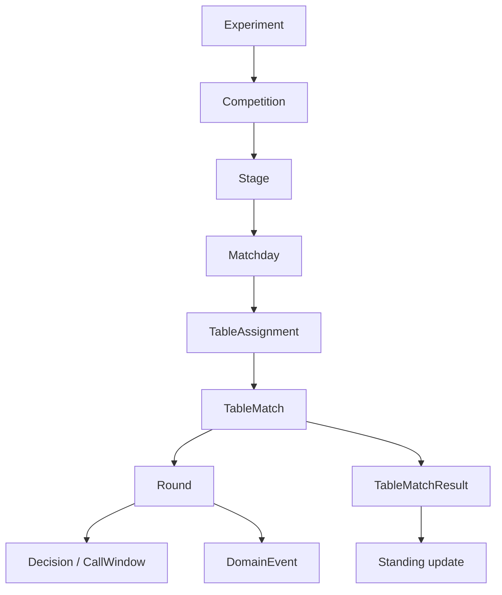
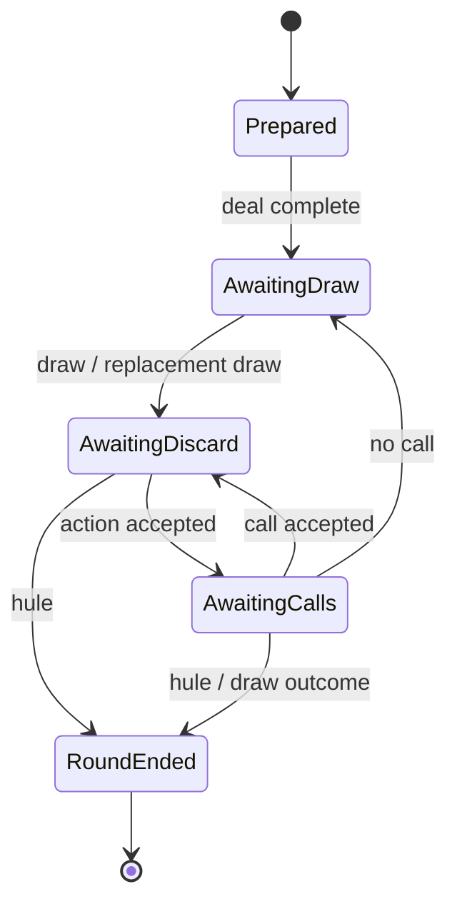

# ドメインモデル

## 1. モデルの階層



卓内 engine が直接知るのは `TableMatch` 以下である。Competition は `TableMatchSpec` を発行し、`TableMatchResult` を受け取る。

## 2. プレイヤー数を型へ持ち上げる

四人と三人は単なる `usize` の違いではない。使用牌、seat、支払、合法 action、順位点の長さが変わるため、player set を型 parameter とする。

```text
PlayerSet
  = FourPlayer  { Seats = East, South, West, North }
  | ThreePlayer { Seats = East, South, West }

ValidatedRuleSet<P: PlayerSet>
TableState<P: PlayerSet, S: Phase>
Placement<P: PlayerSet>
```

これは擬似表現である。const generic と trait のどちらを採用するかは walking skeleton で決める。要件は、四人用の順位配列を三人卓へ渡せないこと、無効 seat を作れないことである。

実験設定の読込み時は人数が runtime 値なので、境界 enum `AnyValidatedRuleSet = FourPlayer(...) | ThreePlayer(...)` で分岐し、分岐後の core は generic な検証済み型で動かす。player count は麻雀固有語ではないため英語を使い、`yonma`/`sanma` のローマ字表記は使わない。

## 3. 主要な値型

primitive obsession を避け、少なくとも次を区別する。

- `ExperimentId`, `CompetitionId`, `TableMatchId`, `RoundId`, `RequestId`, `CallWindowId`
- `ParticipantId`, `TeamId`, `ModelId`, `Seat<P>`
- `Points`, `PlacementPoint`, `RankPoint`, `PenaltyPoint`
- `RuleSetId`, `RuleContentHash`, `SchemaVersion`, `ModelArtifactHash`
- `EventSequence`, `RngKey`, `StateHash`

牌、牌山、本場、供託、場風、親などの麻雀固有概念にも、[用語集](../glossary.md#21-牌行為進行)で確定した `Tile`、`Bipai`、`Ben`、`Lizhibang`、`Quanfengpai`、`Zhuangjia` などの別々の値型を与える。

得点は単位を型で分ける。1000 点を 1.0 とした大会ポイント、卓上の点棒、段位ポイントを同じ整数型で加算できてはならない。

## 4. 牌と牌山

`TileKind`は通常の34種類に赤`5m`、赤`5p`、赤`5s`を加えた37種類とする。同じ`TileKind`の複数枚は個別identityを持たず、個数またはmultisetとして表す。core domainに`TileCopy`を置かない。

`TileSet`は`lizhisim-core`が所有する検証済み実行値であり、37種類それぞれの卓内最大枚数と
総牌数を保持する。rawな赤牌設定、preset metadata、出典は保持しない。`lizhisim-rules`が
設定をsemantic validationした後、coreの検証済みconstructorを通して`TileSet`を生成する。
詳細は[ADR-0015](../adr/0015-rule-and-domain-tile-ownership.md)を参照する。

実装は`lizhisim-core/src/tile_set.rs`に置き、`bingpai.rs`や将来の`bipai.rs`の内部型にしない。
`TileSet`は牌種ごとの上限参照に加え、`Bipai`の完全なmultiset、配牌後の各領域、replay時の
tile conservationを照合する共通基準である。

`bingpai`は`TileKind`の内部indexに対応する`[u8; 37]`の所持枚数配列として保持し、
個々の牌を並べた可変長列としては保持しない。`zimopai`、`he`、canonical eventは
牌の実個体を区別せず`TileKind`を保持する。

`Bingpai`への追加は`TileSet`の対象kind上限を超える場合に失敗する。現在の固定4枚上限は
walking skeletonの暫定実装であり、`TileSet`導入後は赤牌設定や除外牌を反映した上限へ置き換える。

四人用`Bipai`は`[TileKind; 136]`と非公開cursorで保持する。`Zimo`では要素を移動せず、
cursorを進める。三人用`Bipai`の固定長と型構成は、三人麻雀の設計時に決定する。
`Bipai`の再現可能な記録は、重複を許す`TileKind`の順序である。天鳳の0〜135 ID等は
source projectorがtrace用metadataとして保持できるが、canonical state、event、
`StateHash`、agentの`Observation`には含めない。

四人の配牌には`Bipai`のindex 0〜51を使う。各seatは3回の4枚取りで
`i * 16 + seat_index * 4 + j`の12枚を受け取り、最後にindex `48 + seat_index`の
1枚を受け取る。配牌後のcursorは52とし、親のinitial deal由来の14枚目を
index 52から最初の`Zimo`として正規化する。したがって通常の`Zimo`をindex 0から
開始しない。
配牌は`Bipai::qipai`が状態を消費して4人分の`Bingpai`と配牌後の`Bipai`を
一括で返す。外部へ任意indexの取得APIを公開せず、部分配牌やcursorとの不整合を作れないようにする。
`Bipai`は`QipaiPending`と`QipaiCompleted`のtypestateを持ち、`zimo`は`QipaiCompleted`にだけ
提供する。これにより配牌前の牌山から通常の`zimo`を行う状態を表現不能にする。
`remaining_count`は末尾14枚の`wangpai`を除いた残り枚数を返し、通常の`zimo`はこのlive wallが
尽きた時点で`LiveWallExhausted`を返す。`wangpai`からの取得は通常の`zimo`へ含めない。
この値はcursorから都度導出せず`Bipai`の状態として保持し、`qipai`、通常`zimo`、将来の
`lingshang_zimo`が消費した通常ツモ可能枚数に応じて減算する。
公開済み表ドラ表示牌の枚数も`Bipai`の状態として保持する。四人用ではconstructorと`qipai`完了直後を
0とし、上位遷移から初期表示commandを適用した場合だけ1にする。`baopai_indicators`はindex 131から
2ずつ戻る牌をread-only iteratorとして返す。
表示牌の参照自体は公開枚数、通常ツモ位置、嶺上ツモ位置を変更しない。
表ドラの有効・無効とcommand適用時点は`Bipai`で判断しない。rules crateはraw設定を検証してcore所有の
小さなpolicy値へ変換し、coreの`Round`がpolicyから初期・追加表示を指示する。麻雀ruleの実行意味論を
orchestration等の上位crateへ移さない。
`Bipai`は表ドラと裏ドラを別々のcrate-private read-only iteratorとして提供する。どちらも同じ
`baopai_indicator_count`から枚数を導出し、裏ドラ専用のcountやcursorは持たない。表ドラはindex 131、裏ドラは
index 130から、それぞれ2ずつ戻る。取得時点と可視性は`Round`が管理し、通常observationでは表ドラだけを取得し、
和了成立とrule上の裏ドラ適用資格を確定した場合だけ裏ドラを和了評価用viewへ含める。
四人用のcrate-privateな`lingshang_zimo`は取得回数を状態として保持し、index 135から逆順に最大4枚を
取得する。成功時には物理的な王牌補充を表すため通常ツモ可能な`remaining_count`も1減らす。槓・北抜きの
合法性と一回分の取得許可は解釈せず、将来の`Round`遷移から検証済みcommandとして呼び出す。

`xiangting`や`hule`が34種類のcount表現を要求する場合、adapter境界で赤牌を対応する通常の5へ射影する。34種類用の別domain識別子は、必要性が確認されるまで追加しない。

牌構成ルールは次を検証する。

- 37種類それぞれの個数と総牌数
- 赤`5m`、赤`5p`、赤`5s`と対応する通常牌の合計が、設定された各5の枚数を超えない
- 赤牌にできるのは`5m`、`5p`、`5s`だけで、各kindを独立に0〜4枚へ設定できる
- 三麻で除外された牌が配牌・山・ドラ循環に現れない
- 北抜きを使う場合の北牌の存在と扱い
- 王牌、嶺上牌、ドラ表示位置と槓上限の整合

牌山生成はadapterの責務だが、生成後の牌山は`TileKind`の完全な列としてcoreに渡す。seedのみの保存はRNG実装版が固定されている場合に限る。

親へ14枚を配るruleも、親へ13枚を配って第一`Zimo`を行うruleも、coreでは`bingpai`最大13枚と
分離した`zimopai`へ正規化する。initial deal由来の14枚目はcanonical event上の最初の`Zimo`に
するが、親第一打の合法actionには`Moqie`を含めない。`Shouqie`が`bingpai`と`zimopai`を合わせた
14枚を対象とし、`zimopai`と同じ`TileKind`を選んだ場合は`bingpai`のcountsを変更せず
`zimopai`を手切する。live wall由来の`zimopai`を捨てる`Moqie`とは区別する。詳細は
[ADR-0012](../adr/0012-normalize-dealer-first-draw.md)と
[ADR-0016](../adr/0016-initial-deal-shouqie-action.md)に従う。

第一打および第一巡に依存する条件を`He::is_empty()`から推定しない。第一打前に暗槓または北抜きが
行われても`He`は空のままであり、状態の意味を復元できないためである。各playerが第一巡の資格を
保持するかを`first_turn_eligible`として持つ。通常の`Dapai`ではactorだけをfalseにし、副露など
第一巡を中断するactionでは全playerをfalseにする。天和、地和、人和、ダブル立直は、現在phaseと
playerごとの状態を組み合わせて判定する。暗槓、北抜き等が資格を失わせる条件はrule variationとして
検証し、対応するaction遷移が原子的に更新する。

`Sipai`は`TileKind`と`moqie`だけを保持し、各要素へ立直宣言牌flagを持たせない。立直宣言牌は一人につき
高々一枚であり、追記専用の`He`における位置をplayerの`LizhiState`から参照する。位置は裸の整数ではなく、
`He`の最大27要素に収まり、実在する要素だけを指せる検証済み`SipaiIndex`とする。`He`の要素を削除または
並べ替えないため、記録後のindexは局終了まで安定する。

`LizhiState`は少なくとも未宣言、宣言牌を`He`へ追加して応答解決を待つ状態、成立済み状態を区別する。
応答待ちと成立済みの両方が同じ`SipaiIndex`を保持し、宣言牌への和了可能性を解決する前に立直成立として
扱わない。宣言牌かどうかは`Sipai`自身のfieldではなく、`LizhiState`のindexと`He`のindexを比較して導く。
特徴量、observation、eventへの射影はこの導出結果を使う。

立直宣言を伴う`Dapai`は通常の`Dapai`と別actionとし、`He`への宣言牌追加、`SipaiIndex`の生成、
`LizhiState`の応答待ちへの遷移を原子的に行う。応答解決後に成立済みへ進め、供託の確定時点も同じ
遷移境界で扱う。通常の`Dapai`だけを実装する段階では`LizhiState`を先行実装しない。

`Bingpai`の任意countsを作るconstructorと、牌種を直接追加・除去する低水準操作はcrate内に閉じる。
公開された手牌更新は、検証済み`Bipai`からの`qipai`と、現在phaseを消費する`Round`のツモ、
打牌、副露遷移だけから行う。進行phaseは`Bingpai`自体のtypestateへ重ねず、合法actionを判断する
`Round`のtypestateで表す。低水準操作の失敗型`BingpaiError`は、将来の`Player` / `Round`遷移errorが
型付きsourceとして保持できるよう公開するが、低水準操作自体は公開しない。

## 5. Typestate

`Round` を nullable field の集合で表現しない。Phase ごとに必要な data と合法な遷移を分ける。

配牌済み`Bipai`、player set固有の`Player`集合、現在actor、親は進行中の全phaseで必要なため、
phase payloadではなく`Round<P, State>`が直接所有する。`State`は`zimopai`、打牌原因、reactor集合など
そのphaseだけに存在するdataを保持する。共通dataも不変値ではなく、消費型遷移が必要なfieldを更新して
次の`Round`へ値で移送する。

player setごとのmarkerと`Player`集合型は`player_set` moduleに置く。牌山配列だけを扱う`BipaiSpec`へ
追加せず、sealed `PlayerSet`が
associated typeとして所有し、四人用は`[Player<FourPlayer>; 4]`、将来の三人用は
`[Player<ThreePlayer>; 3]`とする。これにより人数とplayer配列長の不一致を型として作れない。
`PlayerSet`と`BipaiSpec`は互いをsupertraitにせず、両方の機能を所有する`Round`が
`P: PlayerSet + BipaiSpec`として合成する。型parameter名`P`はplayer-set markerを表すため維持する。
`bipai`、`players`、actor、親の参照APIはphaseに依存しない共通`Round`実装とし、private trait boundで
phaseごとに中継しない。



実際には次の中間状態も分離候補になる。

- `AwaitingReplacementDraw` — 槓または北抜き後
- 加槓/暗槓に対する和了窓
- 槓成立、宝牌公開、嶺上の順序を解決する状態
- `AwaitingLizhiConfirmation` — 宣言牌への和了・副露と供託成立の境界
- `ExhaustedWall` — 聴牌公開と流局精算

識別子が未確定の槓・北抜き等の中間状態は、glossary の決定後に命名する。

各状態は可能な操作だけを公開する。たとえば `AwaitingDraw` に discard を受ける関数は存在しない。
`Round`の実装開始は、`Bingpai`、`fulu`、`he`を所有する`Player`の状態と遷移を設計してからとする。

## 6. 所有権を用いた遷移

遷移関数は `&mut` で任意箇所を更新し続けず、現在状態を消費する。成功時に新状態を返し、失敗時は型付きerrorだけを返して部分更新状態を公開しない。消費済みの入力状態をerrorから回収することは要求しない。

```text
apply_action(
  AwaitingDiscard<P>,
  TypedAction
) -> Advanced<AwaitingCalls<P>> | Completed<RoundResult>
```

大きな immutable structure を毎回 deep clone することは要求しない。Rust の所有権、small copy value、内部で安全に閉じた copy-on-write などを計測して選ぶ。ただし性能最適化のために、外部から途中状態を観測できる部分更新や rollback 前提の設計へ戻さない。

## 7. Action

model 向けの安定 `ActionId` と、domain の `TypedAction` を分ける。個別 variant は glossary で確定した `Zimo`、`Dapai`、`Chi`、`Peng`、`Angang`、`Daminggang`、`Jiagang`、`Rong` などを使う。これは識別子の確定であり、単一の巨大な action enum を採用する決定ではない。

```text
ModelActionId --decode + legal set--> TypedAction
```

すべての variant がすべての decision point で使えるわけではない。合法手生成時に action の完全なパラメータを持たせ、model はその有限集合から選択する。model から任意の tile index を受けて後から意味を推測しない。

同じ見た目の打牌でも、リーチ宣言を伴う action と通常打牌は別 action とする。暗槓候補が複数ある場合も各候補を別 ID にする。

## 8. 鳴き窓のモデル

`CallWindow` は次を保持する。

- 原因 event（打牌、加槓、暗槓など）
- rule snapshot ID
- eligible seat と各 seat の `LegalCallSet`
- required/optional response slot
- timeout/disconnect の解決値
- すでに受理した応答
- 一度だけ使える resolution continuation

解決は次の純粋関数で考える。

```text
resolve_call_window(rules, cause, responses)
  -> NoCall | HuleCalls | FuluCall | DrawOutcome
```

ロン同士、ロンとポン、ポンとチーの優先順位、頭ハネ/複数ロン/三家和流局はここで決める。queue 到着時刻は引数に含めない。

## 9. `hule`・`xiangting` port

domain は外部 crate の data model へ直接合わせない。

```text
XiangtingPort
  evaluate(ValidatedXiangtingInput, TileAvailability?) -> XiangtingResult

HuleEvaluationPort
  evaluate(HuleContext, ValidatedRuleCapabilities) -> HuleEvaluation
```

`HuleContext` は `bingpai`、`fulu`、和了牌、seat、場風、和了方法、`lizhi` 状態、特殊状況、宝牌表示を明示する。adapter が不足情報を global state から取りに行かない。

`HuleEvaluation` と実際の支払は分ける。前者は役・符・翻・base points、後者は本場、供託、責任払い、三人麻雀の自摸補正、複数和了を含む `PaymentPolicy` が `PointTransfers` を生成する。未確定の値型名は glossary で決める。

`hule` が点数移動まで計算する場合も、capability を明示し、重複計算を避ける境界を契約テストで固定する。

## 10. 対局進行

`TableMatchState<P>` は終了していない `Round` と、次の `Round` を開始するための ledger を分ける。

- 現在の場風と親
- 本場と供託
- seat points
- match rule snapshot
- completed round summaries
- termination context

`Round` 終了時に `RoundSettlement` を適用し、次のいずれかを返す。

```text
Continue(NextRoundSpec)
Extend(NextRoundSpec, ExtensionReason)
Finish(TableMatchResult)
```

アガリ止め、聴牌止め、トップ条件、飛び、規定場、延長上限、同点は `MatchTerminationPolicy` が判断する。局 engine 内へ特定サービス名の分岐を置かない。

## 11. イベント

command/response と event を区別する。event は起きた事実を過去形で表す。

候補 category:

- lifecycle: `TableMatchStarted`, `RoundStarted`, `RoundEnded`, `TableMatchEnded`
- action: `ActionRequested`, `ActionAccepted`, `LizhiDeclared`, `FuluDeclared`
- resolution: `CallWindowOpened`, `DecisionAccepted`, `CallWindowResolved`
- outcome: `HuleConfirmed`, `RoundDrawn`, `PointsTransferred`
- protocol: `DecisionRequested`, `DecisionTimedOut`, `LateResponseIgnored`
- integrity: `StateHashed`, `ReplayVerified`

摸牌、打牌、槓、北抜き、牌山 commit 等の event 名は、対応する glossary 識別子が決まってから追加する。

非公開情報を含む canonical domain event と、seat/public view への射影を分ける。学習 trajectory に完全 event をそのまま渡さない。

## 12. 不変条件の例

- 各`TileKind`の個数は卓全体で設定値を保ち、すべての場所の合計が総牌数と一致する。
- 各 phase の `bingpai` 枚数は `fulu`、槓、北抜きと整合する。
- 点数移動の合計は、卓外 penalty/オカなど明示的 source/sink がない限りゼロである。
- request は一つの table lifecycle と continuation に属する。
- continuation は高々一回だけ消費される。
- event sequence は stream 内で単調増加し欠番を検出できる。
- `Observation<Seat>`はそのseatがまだ知り得ない`TileKind`と個数を含まない。
- `TableMatchResult` の順位は player set の全 seat を重複なく含む。

これらは example test だけでなく property/model-based test の対象にする。

### `Bipai`の固定配列とplayer set

`Bipai<P>`は既存のplayer set markerをgeneric parameterに使い、牌列の固定配列型をsealed `BipaiSpec` traitのassociated typeで決める。四人用`FourPlayer`は`[TileKind; 136]`を使う。これにより`Bipai<P, const N: usize>`のようにplayer setと牌数を別々に指定せず、矛盾する組合せを型として作れない。

`remaining_count`と配牌完了後の`zimo`はplayer set固有の定数や配牌形式に依存しないため、
`Bipai<P>`の共通操作とする。固定配列の検証と初期値を決めるconstructor、および配牌形式を
決める`qipai`はplayer set固有の実装とする。

coreはshuffleを行わず、shellが乱数で生成した配列、unit testの固定配列、conformance入力から復元した配列を同じconstructorへ渡す。constructorは`TileSet`を借用して完全multiset一致を検証し、`Bipai`は検証後の固定配列を値として保持する。三人用配列は三人麻雀を実装するPhaseまで追加しない。
