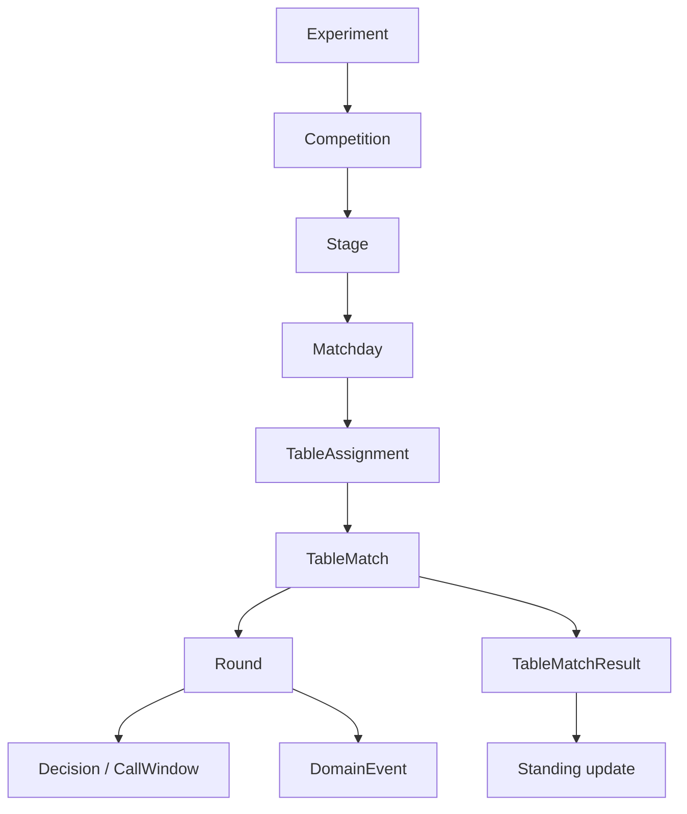
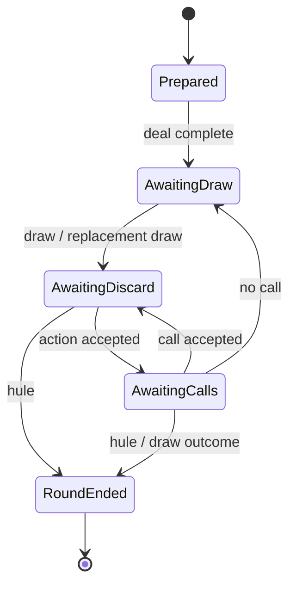

# ドメインモデル

## 1. モデルの階層



卓内 engine が直接知るのは `TableMatch` 以下である。Competition は `TableMatchSpec` を発行し、`TableMatchResult` を受け取る。

## 2. プレイヤー数を型へ持ち上げる

四人と三人は単なる `usize` の違いではない。使用牌、seat、支払、合法 action、順位点の長さが変わるため、player set を型 parameter とする。

```text
PlayerSet
  = FourPlayer  { Seats = East, South, West, North }
  | ThreePlayer { Seats = East, South, West }

ValidatedRuleSet<P: PlayerSet>
TableState<P: PlayerSet, S: Phase>
Placement<P: PlayerSet>
```

これは擬似表現である。const generic と trait のどちらを採用するかは walking skeleton で決める。要件は、四人用の順位配列を三人卓へ渡せないこと、無効 seat を作れないことである。

実験設定の読込み時は人数が runtime 値なので、境界 enum `AnyValidatedRuleSet = FourPlayer(...) | ThreePlayer(...)` で分岐し、分岐後の core は generic な検証済み型で動かす。player count は麻雀固有語ではないため英語を使い、`yonma`/`sanma` のローマ字表記は使わない。

## 3. 主要な値型

primitive obsession を避け、少なくとも次を区別する。

- `ExperimentId`, `CompetitionId`, `TableMatchId`, `RoundId`, `RequestId`, `CallWindowId`
- `ParticipantId`, `TeamId`, `ModelId`, `Seat<P>`
- `Points`, `PlacementPoint`, `RankPoint`, `PenaltyPoint`
- `RuleSetId`, `RuleContentHash`, `SchemaVersion`, `ModelArtifactHash`
- `EventSequence`, `RngKey`, `StateHash`

牌、牌山、本場、供託、場風、親などの麻雀固有概念にも、[用語集](../glossary.md#21-牌行為進行)で確定した `Tile`、`Bipai`、`Ben`、`Lizhibang`、`Quanfengpai`、`Zhuangjia` などの別々の値型を与える。

得点は単位を型で分ける。1000 点を 1.0 とした大会ポイント、卓上の点棒、段位ポイントを同じ整数型で加算できてはならない。

## 4. 牌と牌山

`TileKind`は通常の34種類に赤`5m`、赤`5p`、赤`5s`を加えた37種類とする。同じ`TileKind`の複数枚は個別identityを持たず、個数またはmultisetとして表す。core domainに`TileCopy`を置かない。

`bingpai`、`zimopai`、`he`、`Bipai`、canonical eventは`TileKind`だけを保持する。`Bipai`の再現可能な記録は、重複を許す`TileKind`の順序である。天鳳の0〜135 ID等はsource projectorがtrace用metadataとして保持できるが、canonical state、event、`StateHash`、agentの`Observation`には含めない。

`xiangting`や`hule`が34種類のcount表現を要求する場合、adapter境界で赤牌を対応する通常の5へ射影する。34種類用の別domain識別子は、必要性が確認されるまで追加しない。

牌構成ルールは次を検証する。

- 37種類それぞれの個数と総牌数
- 赤`5m`、赤`5p`、赤`5s`と対応する通常牌の合計が、設定された各5の枚数を超えない
- 赤牌にできるのは`5m`、`5p`、`5s`だけで、各kindを独立に0〜4枚へ設定できる
- 三麻で除外された牌が配牌・山・ドラ循環に現れない
- 北抜きを使う場合の北牌の存在と扱い
- 王牌、嶺上牌、ドラ表示位置と槓上限の整合

牌山生成はadapterの責務だが、生成後の牌山は`TileKind`の完全な列としてcoreに渡す。seedのみの保存はRNG実装版が固定されている場合に限る。

親へ14枚を配るruleも、親へ13枚を配って第一`Zimo`を行うruleも、coreでは`bingpai`最大13枚と分離した`zimopai`へ正規化する。initial deal由来の14枚目はcanonical event上の最初の`Zimo`にするが、その直後に同じ牌を`Dapai`してもlive wall由来の`zimopai`を捨てたとは扱わない。詳細は[ADR-0012](../adr/0012-normalize-dealer-first-draw.md)に従う。

## 5. Typestate

`Round` を nullable field の集合で表現しない。Phase ごとに必要な data と合法な遷移を分ける。



実際には次の中間状態も分離候補になる。

- `AwaitingReplacementDraw` — 槓または北抜き後
- 加槓/暗槓に対する和了窓
- 槓成立、宝牌公開、嶺上の順序を解決する状態
- `AwaitingLizhiConfirmation` — 宣言牌への和了・副露と供託成立の境界
- `ExhaustedWall` — 聴牌公開と流局精算

識別子が未確定の槓・北抜き等の中間状態は、glossary の決定後に命名する。

各状態は可能な操作だけを公開する。たとえば `AwaitingDraw` に discard を受ける関数は存在しない。

## 6. 所有権を用いた遷移

遷移関数は `&mut` で任意箇所を更新し続けず、現在状態を消費する。成功時に新状態を返し、失敗時は入力状態を変更しない。

```text
apply_action(
  AwaitingDiscard<P>,
  TypedAction
) -> Advanced<AwaitingCalls<P>> | Completed<RoundResult>
```

大きな immutable structure を毎回 deep clone することは要求しない。Rust の所有権、small copy value、内部で安全に閉じた copy-on-write などを計測して選ぶ。ただし性能最適化のために、外部から途中状態を観測できる部分更新や rollback 前提の設計へ戻さない。

## 7. Action

model 向けの安定 `ActionId` と、domain の `TypedAction` を分ける。個別 variant は glossary で確定した `Zimo`、`Dapai`、`Chi`、`Peng`、`Angang`、`Daminggang`、`Jiagang`、`Rong` などを使う。これは識別子の確定であり、単一の巨大な action enum を採用する決定ではない。

```text
ModelActionId --decode + legal set--> TypedAction
```

すべての variant がすべての decision point で使えるわけではない。合法手生成時に action の完全なパラメータを持たせ、model はその有限集合から選択する。model から任意の tile index を受けて後から意味を推測しない。

同じ見た目の打牌でも、リーチ宣言を伴う action と通常打牌は別 action とする。暗槓候補が複数ある場合も各候補を別 ID にする。

## 8. 鳴き窓のモデル

`CallWindow` は次を保持する。

- 原因 event（打牌、加槓、暗槓など）
- rule snapshot ID
- eligible seat と各 seat の `LegalCallSet`
- required/optional response slot
- timeout/disconnect の解決値
- すでに受理した応答
- 一度だけ使える resolution continuation

解決は次の純粋関数で考える。

```text
resolve_call_window(rules, cause, responses)
  -> NoCall | HuleCalls | FuluCall | DrawOutcome
```

ロン同士、ロンとポン、ポンとチーの優先順位、頭ハネ/複数ロン/三家和流局はここで決める。queue 到着時刻は引数に含めない。

## 9. `hule`・`xiangting` port

domain は外部 crate の data model へ直接合わせない。

```text
XiangtingPort
  evaluate(ValidatedXiangtingInput, TileAvailability?) -> XiangtingResult

HuleEvaluationPort
  evaluate(HuleContext, ValidatedRuleCapabilities) -> HuleEvaluation
```

`HuleContext` は `bingpai`、`fulu`、和了牌、seat、場風、和了方法、`lizhi` 状態、特殊状況、宝牌表示を明示する。adapter が不足情報を global state から取りに行かない。

`HuleEvaluation` と実際の支払は分ける。前者は役・符・翻・base points、後者は本場、供託、責任払い、三人麻雀の自摸補正、複数和了を含む `PaymentPolicy` が `PointTransfers` を生成する。未確定の値型名は glossary で決める。

`hule` が点数移動まで計算する場合も、capability を明示し、重複計算を避ける境界を契約テストで固定する。

## 10. 対局進行

`TableMatchState<P>` は終了していない `Round` と、次の `Round` を開始するための ledger を分ける。

- 現在の場風と親
- 本場と供託
- seat points
- match rule snapshot
- completed round summaries
- termination context

`Round` 終了時に `RoundSettlement` を適用し、次のいずれかを返す。

```text
Continue(NextRoundSpec)
Extend(NextRoundSpec, ExtensionReason)
Finish(TableMatchResult)
```

アガリ止め、聴牌止め、トップ条件、飛び、規定場、延長上限、同点は `MatchTerminationPolicy` が判断する。局 engine 内へ特定サービス名の分岐を置かない。

## 11. イベント

command/response と event を区別する。event は起きた事実を過去形で表す。

候補 category:

- lifecycle: `TableMatchStarted`, `RoundStarted`, `RoundEnded`, `TableMatchEnded`
- action: `ActionRequested`, `ActionAccepted`, `LizhiDeclared`, `FuluDeclared`
- resolution: `CallWindowOpened`, `DecisionAccepted`, `CallWindowResolved`
- outcome: `HuleConfirmed`, `RoundDrawn`, `PointsTransferred`
- protocol: `DecisionRequested`, `DecisionTimedOut`, `LateResponseIgnored`
- integrity: `StateHashed`, `ReplayVerified`

摸牌、打牌、槓、北抜き、牌山 commit 等の event 名は、対応する glossary 識別子が決まってから追加する。

非公開情報を含む canonical domain event と、seat/public view への射影を分ける。学習 trajectory に完全 event をそのまま渡さない。

## 12. 不変条件の例

- 各`TileKind`の個数は卓全体で設定値を保ち、すべての場所の合計が総牌数と一致する。
- 各 phase の `bingpai` 枚数は `fulu`、槓、北抜きと整合する。
- 点数移動の合計は、卓外 penalty/オカなど明示的 source/sink がない限りゼロである。
- request は一つの table lifecycle と continuation に属する。
- continuation は高々一回だけ消費される。
- event sequence は stream 内で単調増加し欠番を検出できる。
- `Observation<Seat>` はその seat がまだ知り得ない tile copy を含まない。
- `TableMatchResult` の順位は player set の全 seat を重複なく含む。

これらは example test だけでなく property/model-based test の対象にする。
