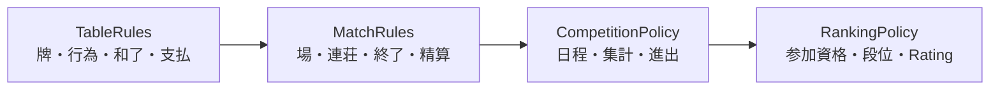

# ルールとプリセット

## 1. 方針

「雀魂ルール」のような名前を engine の条件分岐にしない。公式ルールを構造化した完全設定を検証し、engine はその値だけを見る。プリセットは便利な名前付き入力であると同時に、出典と版を固定した監査対象である。

ルールは次の四層に分ける。



各層は独立に版管理し、`ResolvedExperimentSpec` が使う版を束ねる。卓内ルールの改定と段位ポイントの改定を同じ版番号で扱わない。

## 2. 設定の lifecycle

```text
Source evidence
  -> RawRuleSpec
  -> schema validation
  -> semantic validation
  -> capability validation
  -> ValidatedRuleSet<P>
  -> canonical serialization + content hash
  -> immutable preset version
```

- **schema validation**: 必須項目、enum、数値範囲、未知 field を検査する。
- **semantic validation**: 人数、牌、支払、終了条件の相互矛盾を検査する。
- **capability validation**: 現 engine と `hule`/`xiangting` adapter が全条項を実行できるか検査する。
- 未知 field を無視して前方互換に見せない。意味が変わる設定の取りこぼしを防ぐため拒否する。

## 3. TableRules の設定領域

### 3.1 プレイヤーと牌

| 領域 | 主な option |
|---|---|
| 人数 | four-player / three-player |
| 使用牌 | 赤牌を区別した37種類ごとの枚数、三麻の除外牌、総牌数 |
| 赤牌 | `5m`・`5p`・`5s`ごとの赤牌枚数（各0〜4）、赤牌のドラ扱い |
| 北 | 通常牌/役牌/客風、抜き可否、抜きドラ、手牌扱い、抜いた直後の補充元、槍北可否 |
| 王牌 | 王牌枚数、嶺上枚数、ドラ表示位置、最大槓数 |
| 配牌 | 親子枚数、第一ツモの扱い、自動配牌差の正規化 |

赤牌設定は`5m`、`5p`、`5s`を独立に0〜4枚とする。対応する通常の5の枚数は「その牌の総数 - 赤牌枚数」で解決し、負数を拒否する。`1m`等の数牌や字牌を赤牌にする一般化は行わない。解決後の設定とcore stateは、赤牌を独立させた37種類の`TileKind`ごとの枚数を持つ。

### 3.1.1 crate ownership

`lizhisim-rules`はrawな牌設定、schema、semantic validation、`ValidatedRuleSet<P>`、
preset metadataを所有する。解決後にcoreが実行時検証で使う37種類の最大枚数は、
`lizhisim-core`所有の`TileSet`へ変換する。rules crateがdomain型を使うのは、このような
検証済み実行値を生成する境界に限定する。

`ValidatedRuleSet<P>`全体をcore遷移へ渡さない。卓内runtimeが必要な`TileSet`や小さな
policy値を抽出して渡し、coreはschema、preset identity、出典、内容hashを参照しない。
詳細は[ADR-0015](../adr/0015-rule-and-domain-tile-ownership.md)を参照する。

局内状態を参照する行為競合、途中流局、流し満貫などの項目は、検証済み`TableRules`から
`RoundPolicy<P>`へ射影して`Round`開始時に渡す。`RoundPolicy`は局中に差し替えない。
`Round`は局内状態から候補を検出した直後にこのpolicyを適用し、採用時だけ確定outcomeとして
`RoundEnded`を返す。不採用の途中流局候補を外側へ通知して局を一時停止する方式にはしない。

親へ14枚を配る方式と、親へ13枚を配って第一`Zimo`を行う方式は、
[ADR-0012](../adr/0012-normalize-dealer-first-draw.md)と
[ADR-0016](../adr/0016-initial-deal-shouqie-action.md)に従い、内部ではどちらも`RoundStarted`後の
最初の`Zimo`へ正規化する。設定は最初の牌がinitial deal由来かlive wall由来かを表す。
initial deal由来の親第一打では`Moqie`を提示せず、分離された`zimopai`を含む14枚を
`Shouqie`の対象とする。`moqie`を独立したrule optionとして重複設定しない。

### 3.2 行為

| 領域 | 主な option |
|---|---|
| チー | 可否、対象 seat、食い替え制限 |
| ポン/明槓 | 可否、優先順位、発声競合 |
| 暗槓/加槓 | 可否、リーチ後条件、待ち/面子構成/役変化条件、槍槓窓 |
| リーチ | 必要点数、残りツモ条件、供託、フリテンリーチ、オープンリーチ等の local rule |
| 和了選択 | 見逃し後の同巡/以後フリテン、リーチ後の見逃し |
| 応答窓 | 同時ロン、head bump、複数ロン、三家和流局、seat priority |
| timeout | 卓内ルールではなく実験方針として pass/自摸切り/forfeit を選ぶ |

### 3.3 流局

個別 enum/flag とし、一つの `abortive_draws: true` へまとめない。

- 九種九牌
- 四風連打
- 四家立直（または三家立直）
- 四槓散了と一人四槓時の扱い
- 三家和
- exhaustive draw
- 流し満貫を和了/流局精算/不採用のどれとして扱うか
- 聴牌の定義、形式聴牌、自己の牌を使い切った待ち
- 聴牌公開、ノーテン罰符

途中流局の候補検出は、必要な河、副露、槓、第一巡、call windowを所有する`Round`内の純粋な判定とする。
候補検出だけでは局を終了せず、対応する`RoundPolicy`項目が採用する場合に限り`RoundEnded`へ遷移する。
不採用の場合は、四風連打等の候補が成立する形でも打牌完了・call window解決後の通常遷移を続ける。
九種九牌のようにplayerの選択を必要とする途中流局は、policyが有効な場合だけ合法actionへ含める。
三家和はronのcall window解決中に、頭ハネ・複数ロン・途中流局のpolicyと合わせて一意に解決する。

`RoundEnded`へ含める流局種別、聴牌seat、流し満貫の資格seatはpolicy適用後の確定した局内事実とする。
`RoundSettlement`はこれらを再判定せず、支払い、連荘、本場、供託、次局への効果だけを扱う。

### 3.4 役と和了制限

| 領域 | 主な option |
|---|---|
| 一翻縛り | 常時、場による変更 |
| 喰いタン/後付け | 可否 |
| 一発・裏・槓ドラ・槓裏 | 個別可否 |
| 役一覧 | 門前限定、食い下がり、local 役 |
| 役満 | 一覧、複合、double variant、責任払い対象 |
| 数え役満 | 不採用/役満/三倍満上限など |
| 人和 | 不採用、通常役、満貫、倍満、役満など明示型 |
| 国士無双 | 暗槓への槍槓、十三面の扱い |
| 緑一色等 | 構成牌条件の variation |

役名の文字列と翻数だけでは判定意味論を表せない。engine が対応する `YakuRuleId` の閉じた集合と parameter を使い、未知の custom expression を実行しない。

### 3.5 符・翻・上限

- 連風牌の雀頭符
- 嶺上開花のツモ符
- 平和ツモの符
- 七対子の固定符・翻
- 切り上げ満貫の条件
- 満貫、跳満、倍満、三倍満、役満の境界
- 役満複合と数え上限
- 点数丸め単位

「一般的な計算」を default として暗黙採用せず、validated preset は全項目を解決する。

### 3.6 支払

- 親/子のロン・ツモ支払
- 本場の一人あたりまたは総加点
- 三麻のツモ損、折半、北家分補正などの方式
- 複数ロン時の本場と供託配分
- 責任払いの対象役とロン/ツモ時の分担
- 点棒単位と端数丸め

支払結果は `Transfer { from, to, amount, reason }` の集合とし、各 transfer の理由を監査可能にする。

## 4. MatchRules の設定領域

| 領域 | 主な option |
|---|---|
| 初期値 | 開始点、返し点、起家/座順 |
| 規定場 | 東風、東南、任意の場の進行順 |
| 連荘 | 親和了、親聴牌、流局種別ごとの継続 |
| 本場 | 増減条件、上限 |
| 延長 | 南入/西入等、必要トップ点、最大場、サドンデス |
| 終了 | 飛び条件（負/0以下）、目標点、時間管理 event |
| all-last | アガリ止め、聴牌止め、順位条件、続行選択の有無 |
| 同点 | 起家順、同順位、順位点分配、追加局 |
| 精算 | オカ、ウマ/順位点、残供託、1000点単位変換 |

`MatchRules`は確定済みの和了・荒牌平局・途中流局outcomeを入力とし、途中流局の採用可否を決めない。
終了判定は `RoundSettlement` 適用後の一か所で行い、和了処理と流局処理に重複させない。

## 5. CompetitionPolicy と RankingPolicy

卓内設定に次を入れない。

- 何半荘の合計か、連続 N 戦の最大値か
- レギュラー/セミファイナル/ファイナルの持越し率
- team lineup と最低出場数
- 予選足切り、同点 tie-break、最終戦の条件
- 段位 room の参加資格と場代
- 順位ごとの段位ポイント、降段保護、rating 更新
- matchmaker が誰を同卓させるか

詳細は [大会・段位戦・リーグ戦](competitions.md) に記載する。

## 6. プリセットの identity

### 6.1 Family と不変版

Family ID は人間が検索する安定名、不変版 ID は実験に保存する名前である。

```text
family:     jp.m-league.table
version:    jp.m-league.table@<effective-date-or-document-version>+<revision>
alias:      jp.m-league.table@current
hash:       sha256:<canonical validated content>
```

`current` alias は設定解決時だけ許し、run 開始前に不変版 ID と hash へ置き換える。公式文書に版がない場合は、取得日だけで意味版を偽装せず、snapshot date と独自 revision を metadata に分ける。

### 6.2 Metadata

各版は少なくとも次を持つ。

- family ID / immutable version ID
- config schema version / content hash
- `draft`, `review`, `verified`, `deprecated`, `blocked` の状態
- 対象人数・mode・地域・language
- effective from/to（判明する場合）
- source URL、文書 title/version、取得・確認日時
- game 内資料なら app version、server/region、画面 ID、証跡 hash
- 確認者と review 記録
- unsupported clause と engine capability
- 旧版/後継版、変更理由

`verified` は「すべてのシミュレーション対象条項が一次資料と照合され、golden test がある」ことを意味する。単に起動できる意味ではない。

## 7. 必須プリセット catalog

以下は実装対象 family である。現 Phase 0 では設定データ自体を作らず、監査状態を台帳に記録する。東風/東南、room、season で値が変わる場合は family 内の別版または `MatchRules`/`RankingPolicy` の別 family とする。

### 7.1 オンライン段位戦

| Family ID（予定） | 対象 | Table/Match | Ranking | Phase 0 の監査状態 |
|---|---|---|---|---|
| `mahjongsoul.ranked.four_player` | 雀魂 四人段位戦 | 必須 | 必須 | [公式詳細ルール](https://mahjongsoul.com/news/46)を基点に牌譜検証する |
| `mahjongsoul.ranked.three_player` | 雀魂 三人段位戦 | 必須 | 必須 | 同上 |
| `jp.tenhou.ranked.four_player` | 天鳳 四人段位戦 | 必須 | 必須 | 公式 manual を基点に mode 差分監査が必要 |
| `jp.tenhou.ranked.three_player` | 天鳳 三人段位戦 | 必須 | 必須 | 同上 |
| `jp.riichicity.ranked.four_player` | 麻雀一番街 四人段位戦 | 必須 | 必須 | 公式 Web に完全仕様なし、game 内証跡待ち |
| `jp.riichicity.ranked.three_player` | 麻雀一番街 三人段位戦 | 必須 | 必須 | 同上 |
| `jp.ron2.ranked.four_player` | 龍龍 四人段位戦 | 必須 | 必須 | 公式ルールページ確認、段位制度を追加監査 |
| `jp.ron2.ranked.three_player` | 龍龍 三人段位戦 | 必須 | 必須 | 同上 |

サービス内の room/卓別に卓内ルールが同じで段位ポイントだけ違う場合、`TableRules` を複製せず複数の `RankingPolicy` を組み合わせる。

### 7.2 実装・検証の優先順位

1. **雀魂段位戦（四人/三人）**: 膨大な牌譜を検証 corpus にでき、Cryolite/kanachan の `src/simulation` に雀魂牌譜と照合済みの先行実装がある。
2. **天鳳段位戦（四人/三人）**: 雀魂との差分が比較的小さく、牌譜が公開されている。
3. **麻雀一番街段位戦（四人/三人）**: 雀魂との差分が比較的小さい。

この優先順位は family 全体の完成順である。四人 `Round` core の vertical slice と三人固有機能は段階的に実装してよいが、別の競技 preset を先に `verified` にして優先順位を迂回しない。

### 7.3 競技ルール

| Family ID（予定） | 対象 | 主な variation | Phase 0 の監査状態 |
|---|---|---|---|
| `org.m-league.table` | M リーグ | 公式戦ルールと season competition | 公式ルールページ確認、season 規定は別版 |
| `org.worldriichi.wrc` | WRC | 2025 rules、clarification、optional rules | 2025 公式資料確認、optional を別設定にする |
| `jp.saikouisen.main` | 最高位戦日本プロ麻雀協会 | 本戦/Classic/対局種別特例 | 本ルールを必須、variation は別 family/版 |
| `jp.jpml.a` | 日本プロ麻雀連盟 | 公式/A、WRC、WRC-R を混同しない | 公式ルールを基準、WRC は別 family |
| `jp.npm.main` | 日本プロ麻雀協会 | 競技規定、title 別特例 | 公式競技規定確認、対象大会を明示 |
| `jp.mu.official` | 麻将連合 | μカップ、将王/リーグ等の罰符差 | 公式 PDF と競技規定確認、variation 必須 |
| `jp.rmu.a` | RMU A | 一発・裏あり | 公式ページ確認 |
| `jp.rmu.b` | RMU B | A から一発・裏/槓ドラ差 | 公式ページ確認 |
| `jp.rmu.m` | RMU M | 赤・開始点・順位点・パオ等 | 公式ページ確認 |

日本プロ麻雀連盟の `WRC` と World Riichi Championship の WRC 公式資料は関係するが、出典・改定時期・採用大会を同一 preset と仮定しない。利用者が指定した「WRC」は `org.worldriichi.wrc` を指し、JPML が採用する大会版は別の解決済み版として差分を確認する。

## 8. 設定構造の概念例

これは schema の確定形式ではない。

```yaml
preset:
  id: immutable-version-id
  schema: rule-schema-v1
  status: verified
  sources: [source-snapshot-id]

table_rules:
  player_set: four_player
  tiles: { ...fully resolved... }
  actions: { ...fully resolved... }
  draws: { ...fully resolved... }
  wins: { ...fully resolved... }
  scoring: { ...fully resolved... }
  payments: { ...fully resolved... }

match_rules:
  initial: { ... }
  progression: { ... }
  termination: { ... }
  settlement: { ... }
```

継承用の `extends: other-preset` を canonical 保存形式にしない。authoring tool が差分入力を受け付けても、解決・検証後は完全値と source mapping を保存する。これにより親 preset 更新による過去 run の意味変化を防ぐ。

## 9. Semantic validation の例

- `player_set = three_player` なら seat 数、順位点数、支払 vector が 3。
- 除外した牌に赤 copy や役要件を設定できない。
- 北抜き可なら北牌と replacement draw policy が存在する。
- 複数和了方式の head bump と三家和流局のような競合を拒否する。
- リーチ必要点が 0 未満でない。供託と終了時残供託処理がある。
- 最大槓数と王牌の補充牌数が整合する。
- 数え役満を不採用にした場合も上限点が定義される。
- 連荘または延長に循環上限がなくても、麻雀上の正当な長期継続として scheduler が扱える。
- placement bonus の要素数が人数と一致し、オカ/source/sink を含む精算 conservation が説明できる。
- rule が要求する役/点数 capability を `hule` adapter が宣言している。

## 10. 公式資料の監査手順

1. [公式ルール出典台帳](../references/rule-sources.md) に一次資料を登録する。
2. [ADR-0008](../adr/0008-source-review-without-copying.md)に従い原資料を複製せず、URL、title、版、effective date、取得日時、確認者を`SourceReview`へ記録する。
3. game 内のみの仕様は app version、region、画面遷移、画像 hash を記録する。認証情報や個人情報は保存しない。
4. 条項を設定項目へ一対一または一対多で mapping する。
5. シミュレーション対象外の物理条項も別表へ mapping し、欠落扱いにしない。
6. 別の確認者が値と出典を review する。
7. 各差分を表す最小 golden scenario を red にする。
8. implementation と test が green 後、preset を `verified` へ上げる。

二次資料は一次資料の所在発見と曖昧点の検出に使えるが、値確定の唯一の根拠にはしない。一次資料同士が矛盾する場合は、対象期間と優先条項を確認できるまで `blocked` とする。

## 11. 改定の扱い

公式側の更新を検知しても既存版を編集しない。

1. source snapshot を追加する。
2. 旧版との差分 report を作る。
3. 新しい immutable version を `draft` で作る。
4. 変更した条項の test list を作る。
5. red/green/refactor と review を終える。
6. `verified` にし、`current` alias を原子的に新版へ向ける。
7. 旧版は `deprecated` にできるが、再生のため削除しない。

## 12. 既知のリスク

- オンラインサービスは告知なしに server-side ルールや段位ポイントを変える可能性がある。
- 一次資料が Web、PDF、game 内 help に分散している。
- 同じ団体でも大会、league、年度でルールが異なる。
- 物理競技の裁定条項を計算規則と誤って実装すると、AI simulator に不要な状態が増える。
- 未公開 `hule` の対応範囲次第で preset capability が制限される。

これらは preset の版、source mapping、unsupported clause、contract test で管理する。

実装順と検証根拠の判断は [ADR-0005](../adr/0005-mahjong-soul-first.md) に記録する。

### Raw入力と検証済み設定の境界

`RawRuleSpec`はTOMLなど外部入力をserdeでdecodeした未検証の値を表す。構文・型のdecode後、`RuleSpec`へ変換する際にsemantic validationを行う。`RuleSpec`だけが`TileSet`解決やruntimeへ渡す設定を提供し、外部入力型をdomain遷移へ直接渡さない。
